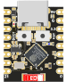

# esp32-c3-super-mini board



inspired by this great repository -> https://github.com/sidharthmohannair/Tutorial-ESP32-C3-Super-Mini

You can find most of the information about the board there. Here I just want to stash some basic RUST examples compatible with esp_hal v0.23.1

You can also copy the .cargo/config.toml and build.rs files from this repository if you just want to build some rust code for the board.

## Just try it

`cargo build --release`

`cargo espflash flash --release`

`cargo espflash monitor`

## Examples

- [blink](examples/blink.rs)
  `cargo espflash flash --release --example blink`

- [snow](examples/sk6812_rgbw_embassy.rs)
  `cargo espflash flash --release --example sk6812_rgbw_embassy`

## Simulate

There is the [wokwi simulator](https://wokwi.com/) and in the wokwi_board folder is custom board for it, so you can test your code without touching the real board. You just need:

  * Create a new [project on wokwi](https://wokwi.com/projects/new/rust-nostd-esp32-c3)
  * Click inside the code editor, press "F1" and choose "Load custom board file..."

## More compehersive 'Getting Started' (if you do not even have rust installed)

### Step 1: Install Rust Using Rustup

Just visit rustup.rs(https://rustup.rs) and proceed with their instructions for your operating system.

### Step 2: Install the esp32-c3-super-mini target

```bash
rustup target add riscv32imc-unknown-none-elf
```

### Step 3: Install ESPFlash

Install ESPFlash using Cargo

```bash
cargo install cargo-espflash
```

Verify Installation

```bash
cargo espflash --version
```

### Step 4: Clone the esp32-c3-super-mini-rust repository

```bash
git clone https://github.com/hahihula/esp32-c3-super-mini-rust.git
```

### Step 5: Connect the Board

Connect the board to your computer using a USB-c cable.

### Step 6: Build and Flash the Blink Example

```bash
cd esp32-c3-super-mini-rust
cargo build --release --example blink
cargo espflash flash --release --example blink
```

### Step 7: Monitor the Serial Output

```bash
cargo espflash monitor
```
